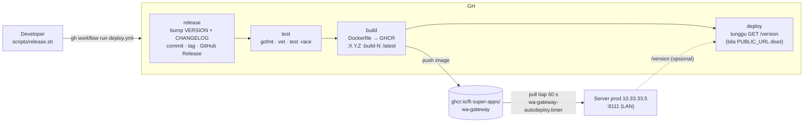
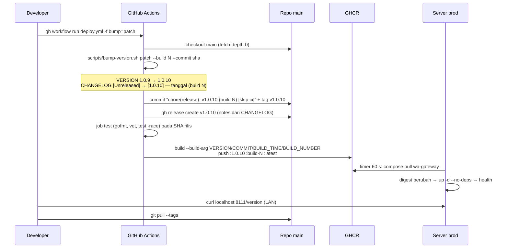
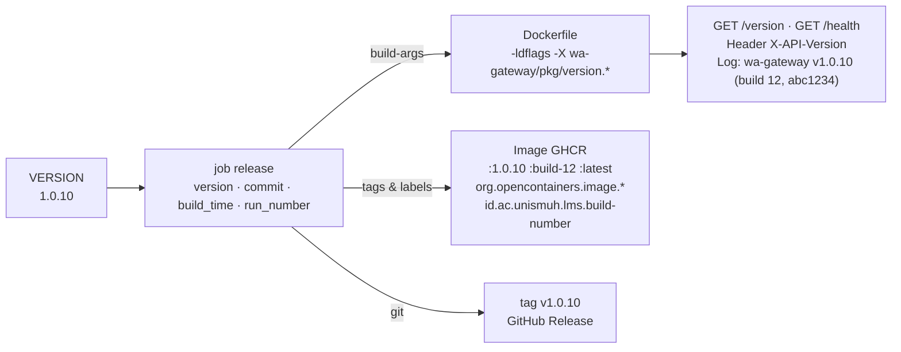

# CI/CD — WA Gateway

Pipeline ini **disalin dari `lms-obe-ai`** (workflow, skrip, konvensi versi) — sama dengan `lms-simak-connector` — agar semua repo dioperasikan dengan cara yang sama. Perbedaan hanya pada isi: satu image Go, service compose bernama `wa-gateway`, gateway berjalan di LAN kampus tanpa URL publik.

Daftar isi

1. [Arsitektur pipeline](#1-arsitektur-pipeline)
2. [Continuous Integration (ci.yml)](#2-continuous-integration-ciyml)
3. [Build & Deploy (deploy.yml)](#3-build--deploy-deployyml)
4. [Deploy pull-based di server](#4-deploy-pull-based-di-server)
5. [Konfigurasi GitHub](#5-konfigurasi-github)
6. [Setup server produksi](#6-setup-server-produksi)
7. [Release harian](#7-release-harian)
8. [Rollback](#8-rollback)
9. [Troubleshooting](#9-troubleshooting)
10. [Versioning & nomor build](#10-versioning--nomor-build)

---

## 1. Arsitektur pipeline



- **Trigger**: `workflow_dispatch` (input `bump`, `skip_deploy`) atau push tag `v*`.
- **Runner**: `ubuntu-latest` untuk semua job (org `FT-Super-Apps` tidak memiliki larger runner LMS).
- **Concurrency** `deploy-production`: satu rilis pada satu waktu.

## 2. Continuous Integration (ci.yml)

Berjalan pada push/PR ke `main` dan `develop`. Commit rilis dari CI memakai `[skip ci]` sehingga tidak memicu run ganda.

| Job | Langkah |
|---|---|
| `test` | `go mod download` → **gofmt** (gagal bila ada file belum diformat) → `go vet` → `go test -race -coverprofile` → `go build` → upload coverage (PR) |
| `docker` | `docker compose config -q` → `docker compose build --no-cache` |

Cermin lokal: `scripts/release.sh` menjalankan gofmt/build/vet (dan `--full`: test -race) sebelum trigger.

## 3. Build & Deploy (deploy.yml)

| Job | Fungsi |
|---|---|
| `release` | Tentukan versi. `workflow_dispatch` dengan `bump≠none` → `scripts/bump-version.sh` menaikkan `VERSION`, memotong `CHANGELOG [Unreleased]` → `[X.Y.Z] — tanggal (build N)`, commit `chore(release): vX.Y.Z (build N) [skip ci]`, tag `vX.Y.Z`, push, `gh release create` dengan catatan dari CHANGELOG. Push tag → baca versi dari tag. `bump=none` → pakai `VERSION` apa adanya. Output: `version, ref, commit, build_time, released`. |
| `test` | Checkout **SHA rilis** (`needs.release.outputs.ref`), gofmt, `go vet`, `go test -race`. |
| `build` | Build image dengan `--build-arg VERSION/COMMIT/BUILD_TIME/BUILD_NUMBER`, push `ghcr.io/ft-super-apps/wa-gateway:{X.Y.Z, build-N, latest}`. `skip_deploy=true` → tanpa tag `:latest` (produksi tidak berubah). Cache `type=gha,scope=wa-gateway`. |
| `deploy` | **Tidak menyentuh server.** Bila repo variable `PUBLIC_URL` diset: polling `${PUBLIC_URL}/version` sampai `version==X.Y.Z && build_number==N` (maks 20 menit). Tanpa `PUBLIC_URL` (kondisi sekarang — gateway LAN-only): job selesai dengan `::notice` berisi perintah verifikasi di server. |

## 4. Deploy pull-based di server

Server menjalankan `wa-gateway-autodeploy.timer` (systemd, tiap 60 s) → [`scripts/autodeploy.sh`](../scripts/autodeploy.sh):

1. `docker compose pull -q wa-gateway` (senyap; gagal → coba tick berikutnya).
2. Bandingkan image ID container berjalan vs `:latest` yang baru ditarik.
3. Berubah → `docker compose up -d --no-deps wa-gateway` → `docker image prune -f`. `wa-postgres` & `wa-minio` tidak disentuh.
4. Health check `http://localhost:${PORT}/health` (maks `HEALTH_WAIT`=90 s) → log `GET /version`.

`flock` mencegah dua tick tumpang tindih. Log: `journalctl -u wa-gateway-autodeploy` atau `/var/log/wa-gateway-autodeploy.log`.

Kenapa pull, bukan SSH dari runner: jalur runner cloud → jump host → LAN kampus sering timeout; dengan pull server hanya butuh koneksi keluar ke `ghcr.io`.

> Sesi WhatsApp tersimpan di PostgreSQL (`wa-postgres`) dan volume `wa_data`; recreate container **tidak** memutus pairing. Setelah restart, `GET /status` harus kembali `connected:true, loggedIn:true` dalam beberapa detik.

## 5. Konfigurasi GitHub

| Jenis | Nama | Keterangan |
|---|---|---|
| Variable (opsional) | `PUBLIC_URL` | URL publik gateway bila kelak diberi reverse proxy. Kosong = job `deploy` tidak memverifikasi. |
| Secret (opsional) | `RELEASE_TOKEN` | PAT dengan `contents:write` — hanya bila branch `main` dilindungi sehingga `GITHUB_TOKEN` tidak boleh push commit rilis |
| Environment | `production` | untuk job `deploy` (boleh diberi *required reviewers*) |
| Packages | GHCR | server login dengan PAT `read:packages` (`docker login ghcr.io`) |

Secret `DEPLOY_*` dari workflow lama (SSH/SCP) **tidak dipakai lagi**.

## 6. Setup server produksi

Folder prod `/home/muhyiddin/docker/wa-gateway` (hand-maintained — repo tidak pernah menimpanya) berisi `docker-compose.yml` + `.env` (`PORT=8111`, `API_KEY` master, `POSTGRES_*`, `MINIO_*`, …).

```bash
# 1. Login GHCR sebagai user pemilik folder (anggota grup docker) — sudah ada di ~/.docker/config.json
# 2. Pasang autodeploy (dari Mac, tanpa menyalin repo; via jump host bila di luar LAN)
AUTODEPLOY_B64=$(base64 < scripts/autodeploy.sh | tr -d '\n')
ssh muhyiddin@10.33.33.5 "sudo env AUTODEPLOY_B64=$AUTODEPLOY_B64 DEPLOY_DIR=/home/muhyiddin/docker/wa-gateway bash -s" \
  < scripts/install-autodeploy.sh

# 3. Cek
systemctl list-timers wa-gateway-autodeploy.timer
curl -s localhost:8111/health; curl -s localhost:8111/version
```

## 7. Release harian

```bash
# tulis perubahan di CHANGELOG.md di bawah "## [Unreleased]"
scripts/release.sh                      # bump patch — cek lokal, push, trigger, pantau
scripts/release.sh minor -m "feat: ..." # commit dulu, lalu rilis minor
scripts/release.sh none -y              # redeploy versi VERSION tanpa bump
```

Atau langsung: `gh workflow run deploy.yml --ref main -f bump=patch`.

Setelah run selesai: `git pull --tags` (commit rilis dibuat oleh CI di atas HEAD Anda). Verifikasi di server: `curl -s localhost:8111/version`.

## 8. Rollback

Semua image tersimpan dengan tag versi dan `build-N`. `docker-compose.prod.yml` memakai `${IMAGE_TAG:-latest}`.

```bash
# di server
cd ~/docker/wa-gateway
sudo systemctl stop wa-gateway-autodeploy.timer   # cegah timer menarik :latest lagi
IMAGE_TAG=1.0.9 docker compose up -d --no-deps wa-gateway
```

Rollback permanen: `git revert` lalu rilis baru (`bump=patch`). Nyalakan kembali timer setelahnya.

Fallback manual tanpa timer: `docker compose pull wa-gateway && docker compose up -d --no-deps wa-gateway`.

## 9. Troubleshooting

| Gejala | Periksa |
|---|---|
| Image baru tidak ditarik server | `systemctl list-timers wa-gateway-autodeploy.timer`, `journalctl -u wa-gateway-autodeploy -n 50`. Umumnya: login GHCR kedaluwarsa, atau `:latest` belum ter-push (`skip_deploy`?). |
| `Client outdated (405) connect failure` di log gateway | Versi client WhatsApp di `whatsmeow` kadaluarsa → `go get go.mau.fi/whatsmeow@latest && go mod tidy`, rilis patch. Gejala di pemakai: `/send/*` 502 `websocket not connected`, `GET /status` `connected:false`. |
| `GET /status` `loggedIn:false` setelah deploy | Sesi ter-logout (device_removed) — `POST /pair` dengan master key (scope `sessions`). |
| Job `release` gagal push | Branch `main` dilindungi → set secret `RELEASE_TOKEN` (PAT). |
| `tag vX.Y.Z sudah ada` | `VERSION` di repo tertinggal dari tag — `git pull --tags`, perbaiki `VERSION`, ulangi. |
| CI `gofmt` gagal | `gofmt -w .` lalu commit. |

## 10. Versioning & nomor build

### 10.1 Prinsip

| Konsep | Sumber | Contoh |
|---|---|---|
| **Versi semantik** `MAJOR.MINOR.PATCH` | File [`VERSION`](../VERSION) — satu sumber kebenaran | `1.1.0` |
| **Nomor build** | `github.run_number` — naik tiap run `Build & Deploy`, tidak berulang | `12` |
| **Commit** | SHA pendek commit rilis | `abc1234` |
| **Waktu build** | UTC RFC 3339 saat job `release` | `2026-09-29T04:00:00Z` |

Aturan SemVer untuk gateway:
- **major** — perubahan **kontrak API** yang memaksa perubahan di aplikasi pemakai (LMS, CRM): hapus/ubah field, ubah semantik, skema auth/scope.
- **minor** — endpoint/field/event webhook baru yang kompatibel ke belakang.
- **patch** — bug fix, upgrade dependensi (termasuk `whatsmeow`), dokumentasi.

### 10.2 Alur rilis otomatis



### 10.3 Ke mana versi dibakar



| Tempat | Bentuk |
|---|---|
| Binary | paket [`pkg/version`](../pkg/version/version.go) — `Version`, `Commit`, `BuildTime`, `BuildNumber` via `-ldflags -X`; fallback `debug.ReadBuildInfo()` (SHA VCS + `-dirty`) saat `go run` tanpa ldflags |
| `GET /version` | `{"version","commit","build_time","build_number","go_version"}` — **tanpa auth**, bentuk identik dengan LMS agar `autodeploy.sh`/`release.sh` sama |
| `GET /health` | `status` + `version`, `build_number`, `commit` |
| Header `X-API-Version` | semua respons |
| Image | tag `X.Y.Z`, `build-N`, `latest`; label OCI + `id.ac.unismuh.lms.build-number`; env `APP_VERSION/APP_COMMIT/APP_BUILD_NUMBER` |
| Git | commit `chore(release): vX.Y.Z (build N)`, tag anotasi, GitHub Release |

### 10.4 Skrip pendukung (identik dengan LMS kecuali nama)

| Skrip | Fungsi |
|---|---|
| [`scripts/bump-version.sh`](../scripts/bump-version.sh) | **salinan verbatim** — naikkan `VERSION`, potong CHANGELOG, `--dry-run` |
| [`scripts/version-ldflags.sh`](../scripts/version-ldflags.sh) | cetak `-ldflags` (module path `wa-gateway/pkg/version`) — `go build -ldflags "$(scripts/version-ldflags.sh)" .` |
| [`scripts/release.sh`](../scripts/release.sh) | alur rilis satu perintah; cek lokal Go-only (gofmt/build/vet; `--full` + test -race); verifikasi prod hanya bila `PROD_URL` diset |
| [`scripts/autodeploy.sh`](../scripts/autodeploy.sh) | timer di server; `SERVICES=wa-gateway`, health ke `PORT` dari `.env` |
| [`scripts/install-autodeploy.sh`](../scripts/install-autodeploy.sh) | pasang unit `wa-gateway-autodeploy.{service,timer}` |
| [`scripts/check-mermaid.mjs`](../scripts/check-mermaid.mjs) | validasi diagram Mermaid di `docs/` (butuh `mermaid`+`jsdom` di `node_modules` — opsional) |

### 10.5 Konvensi CHANGELOG

Sama dengan LMS: tulis **hanya** di bawah `## [Unreleased]` (tanpa tanggal), sub-heading Keep a Changelog (`### Added/Changed/Fixed/Security/Deprecated/Removed/Documentation`), hapus placeholder `_Belum ada perubahan yang belum dirilis._` saat entri pertama. Skrip yang menamai heading menjadi `## [X.Y.Z] — YYYY-MM-DD (build N)`; GitHub Release memuat bagian itu apa adanya.

### 10.6 Versi di lingkungan development

```bash
go build -ldflags "$(scripts/version-ldflags.sh)" -o wa-gateway . && ./wa-gateway
curl -s localhost:3000/version
# {"version":"1.0.9-dev","commit":"7c2ede1-dirty","build_time":"…","build_number":"0","go_version":"go1.26.2"}
```

Sufiks `-dev`/`-dirty` menandai binary non-rilis.
